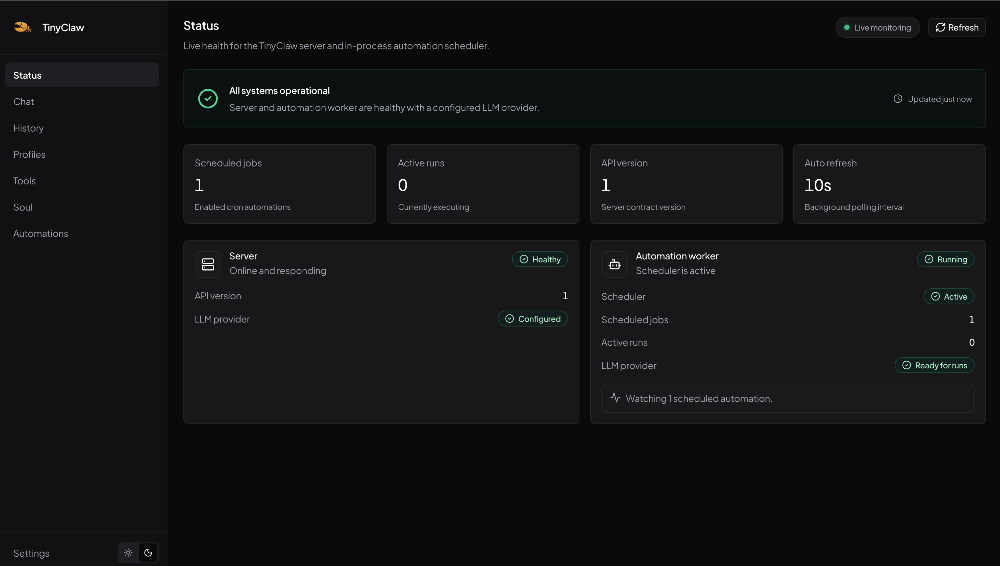

<p align="center">  </p>

# TinyClaw

> Deploy your own personal AI Assistant as easy as using WordPress.

A tiny, working Bun + TypeScript monorepo for running your own AI agent. Chat, create automations from natural language, and connect via web, CLI, Telegram, or WhatsApp — all through one server.



Inspired by [OpenClaw](https://github.com/openclaw/openclaw) and [Hermes](https://github.com/nousresearch/hermes-agent).

- [ARCHITECTURE.md](./ARCHITECTURE.md) — system design, package layout, and data flows

## Quick start

Requires [Bun](https://bun.sh).

```bash
# Install dependencies
bun install

# Start the web (starts the server automatically if needed)
bun run dev:web
```

Visit web dashboard: http://localhost:3000

Or run the server on its own:

```bash
bun run dev:server
```

### Docker

You can also run TinyClaw with Docker.

**Prebuilt image (quickest):**

```bash
# Pull and run the latest image
docker pull ghcr.io/ahmadrosid/tinyclaw:latest
docker run -d -p 4310:4310 -v tinyclaw-config:/root/.tinyclaw ghcr.io/ahmadrosid/tinyclaw:latest
```

**Build from source:**

```bash
# Build the image
docker build -t tinyclaw .

# Run the container
docker run -d -p 4310:4310 -v tinyclaw-config:/root/.tinyclaw tinyclaw
```

The dashboard will be available at http://localhost:4310.

### Integrations

TinyClaw integrates with **Telegram** and **WhatsApp**. Enable them in the web app under **Settings → Telegram** or **Settings → WhatsApp**.

On first run, the server prompts for a provider and API key if none is configured. Settings are saved to `~/.tinyclaw/config.ini`.

The server listens on `http://127.0.0.1:4310` by default. Interactive API docs are available at `http://127.0.0.1:4310/docs`.

## License

MIT
