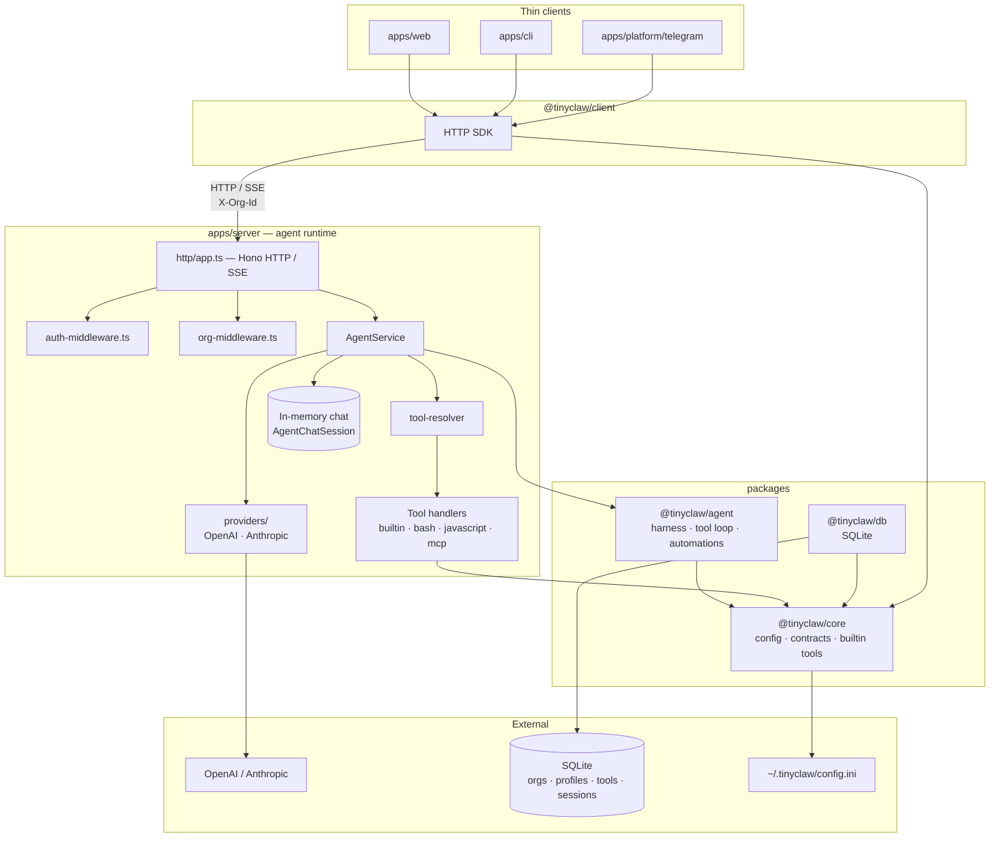

# Architecture

## System overview

**Dependency rule:** `packages/*` never import from `apps/*`. Shared code flows packages → apps only.

## Codemap

**Where is the thing that does X?**

| Question | Look in |
|----------|---------|
| HTTP routing | `apps/server/src/http/app.ts` and `apps/server/src/http/routes/*` |
| HTTP auth / CSRF | `apps/server/src/http/auth-middleware.ts`, `shared.ts`, `public-routes.ts` |
| Org context resolution (`X-Org-Id`, session `active_org_id`) | `apps/server/src/http/org-middleware.ts` |
| Org lifecycle, invites, members, roles | `apps/server/src/services/org-service.ts`, `routes/platform-orgs.ts`, `routes/org-members.ts` |
| Role guards (platform admin, org admin, viewer) | `apps/server/src/http/org-guards.ts` |
| Session lifecycle, model switching | `AgentService` |
| Profile CRUD, soul files, avatar, knowledge base | `apps/server/src/http/routes/profiles.ts`, `AgentService` |
| Resolving DB-backed tools a session may call | `tool-resolver.ts` |
| MCP server registry, connections, profile assignment | `mcp-service.ts`, `mcp-client-manager.ts` |
| Runtime MCP tool expansion for assigned servers | `mcp-tool-bridge.ts` in `AgentService.resolveProfileTools` |
| Super Bot meta-tools, bash | `super-bot-tools.ts`, `bash.ts` |
| LLM vendor calls | `providers/` in `apps/server` |
| Chat, streaming, tool loop | `AgentHarness`, `AgentChatSession` in `@tinyclaw/agent` |
| SQLite schema (`packages/db/sql/schema.sql`) | `@tinyclaw/db` |
| CLI server discovery / spawn | `ensure-server.ts` in `apps/cli` |
| Shared request/response types | `@tinyclaw/core` (`contract.ts`) |
| OpenAPI generation | `apps/server/src/http/openapi.ts` plus route-owned registration in `apps/server/src/http/routes/*` |

Use symbol search for exact paths — names are stable; line numbers are not.

## Boundaries

At a high level:

**Client ↔ server.** `@tinyclaw/client` knows session IDs and API shapes from `@tinyclaw/core`. It has no visibility into providers, profiles beyond the API, or the tool loop.

**HTTP ↔ auth.** Hono middleware enforces bearer auth and browser cookie-session auth. Mutating browser requests must also pass CSRF checks, except for explicitly public routes such as login/setup.

**HTTP ↔ org context.** After auth, org middleware resolves the active org, verifies membership, and attaches role. Clients send `X-Org-Id` (see `@tinyclaw/client`); the web dashboard persists the choice in the browser session via `/v1/auth/active-org`.

**Server ↔ agent package.** `AgentService` owns the session map and delegates to `AgentHarness`. The harness depends on `Provider` from `@tinyclaw/core`, not on HTTP or SQLite.

**Server ↔ database.** Organizations, memberships, invites, and tenant-owned rows (profiles, tools, sessions, automations, etc.) persist in SQLite with `org_id` scoping. Live chat state does not cross this boundary.

**Agent ↔ tools.** The harness asks the model; the server resolves and runs handlers. Builtin tools come from `@tinyclaw/core`; server-specific handlers (bash, Super Bot meta-tools) are registered in `apps/server`.

## Request lifecycle

1. `apps/server/src/http/app.ts` checks static web assets first.
2. Hono auth middleware validates bearer auth or browser session auth, then enforces CSRF for mutating browser requests.
3. Org middleware resolves org context (`X-Org-Id` or session `active_org_id`), verifies membership, and attaches `orgRole`. Skipped for public routes, `/v1/auth/*`, and `/v1/platform/*`.
4. A route handler in `apps/server/src/http/routes/*` parses the request and calls the right service. Role guards (`org-guards.ts`) enforce platform-admin, org-admin, or non-viewer checks where needed.
5. Service code calls `AgentService`, `OrgService`, persistence, workers, MCP, automations, or tasks as needed.
6. `/openapi.json` is served from the same Hono route registration, so docs and runtime stay aligned.

## Cross-cutting concerns

**Configuration** — API key and model live in `~/.tinyclaw/config.ini`, or via `OPENAI_API_KEY` / `ANTHROPIC_API_KEY` (OpenAI preferred when both are set). Provider is inferred automatically. Loaded through `@tinyclaw/core`. The server writes `~/.tinyclaw/runtime/server-url.txt` so clients can find it.

Deployment mailbox settings for the built-in `email` tool live in the `[email]` section of the same `config.ini` file (`imap_host`, `smtp_host`, shared `username`/`password`, TLS flags, and `from`). Org admins manage them from the web System page under the Tools tab. This mailbox is deployment-global, like Telegram/WhatsApp bridge credentials — not per-org database state.

**IDs** — Entities use prefixed IDs via `createId()` (e.g. `org_…`, `session_…`, `profile_…`).

**API versioning** — `TINYCLAW_API_VERSION` is returned by `/health`. The server uses it for singleton detection (don't start a duplicate). Clients should reject incompatible versions.

**OpenAPI** — The HTTP surface is generated from Hono route registration in `apps/server/src/http/routes/*` via `apps/server/src/http/openapi.ts` and served at `/openapi.json`. Treat route code as source of truth.

**Offline-friendly startup** — The server starts without an API key. Chat and automation drafting degrade to heuristic fallbacks when no provider is configured.
