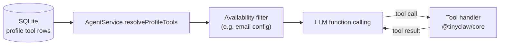

# Builtin tools

TinyClaw ships nine **builtin tools** in `@tinyclaw/core`. Each profile has an allowlist — the model may only call tools assigned to the active profile. Tool definitions use native LLM function calling (JSON Schema parameters). Builtin tool rows are seeded on startup and are protected from deletion.

Platform admins assign tools to profiles from the dashboard. See [Multi-tenancy](/multi-tenancy) for roles and provisioning.

## How tools reach a session

1. The active profile's assigned tools are loaded from SQLite.
2. `AgentService.resolveProfileTools` resolves stored tool records to live `ToolDefinition` handlers (see [Architecture](/architecture) — Agent ↔ tools).
3. Availability filters remove tools that cannot run (for example, `email` when mailbox settings are incomplete).
4. Allowed tools are sent to the provider as function definitions. The model returns tool calls; the server executes handlers and feeds results back as tool messages.

Runtime-injected tools (MCP, automations, Super Bot meta-tools) are assembled after DB-backed tools — see [What's not a builtin](#whats-not-a-builtin).

## Default assignments

On startup, `seedDatabase` upserts all nine builtin tool rows and assigns them to profiles:

| Tool | `default` / `super_bot` | All profiles | Notes |
|------|-------------------------|--------------|-------|
| `write_file` | Yes | No | |
| `delete_file` | Yes | No | |
| `read_file` | Yes | No | |
| `search_files` | Yes | No | |
| `knowledge_base_search` | Yes | No | |
| `web_search` | Yes | No | |
| `update_profile_memory` | Yes | No | |
| `email` | Yes | No | Omitted at runtime when mailbox is unconfigured |
| `create_skill` | Yes | Yes | Only builtin assigned to new custom profiles by default |

**New custom profiles** receive only `create_skill` until a platform admin assigns additional tools. System profiles (`default`, `super_bot`) get the full seeded set.

## Tool reference

### `write_file`

Write text content to a file in the active profile workspace. Creates parent directories if needed.

| Parameter | Type | Required | Notes |
|-----------|------|----------|-------|
| `path` | string | Yes | Relative to profile workspace unless absolute |
| `content` | string | Yes | Text to write |
| `cwd` | string | No | Base directory within workspace; defaults to workspace root |

**Returns:** `{ path, bytesWritten }`

**Scope:** `~/.tinyclaw/profiles/{profileId}/` and `~/.tinyclaw/tools/` (custom JS modules)

**Availability:** When assigned to the profile.

### `delete_file`

Delete a file from disk within the profile workspace or custom tools directory.

| Parameter | Type | Required | Notes |
|-----------|------|----------|-------|
| `path` | string | Yes | Must be within allowed directories |
| `cwd` | string | No | Base directory within workspace |

**Returns:** `{ path, deleted: true }`

**Scope:** Profile workspace and custom tools directory only.

**Availability:** When assigned to the profile.

### `read_file`

Read text from a file in the profile workspace. Supports line pagination for large files.

| Parameter | Type | Required | Notes |
|-----------|------|----------|-------|
| `path` | string | Yes | Relative to profile workspace unless absolute |
| `cwd` | string | No | Base directory within workspace |
| `offset` | number | No | 1-based start line; default 1 |
| `limit` | number | No | Maximum lines to return |

**Returns:** `{ path, content, bytesRead, startLine, endLine, totalLines, truncated }`

**Scope:** Profile workspace and custom tools directory. Reading `config.ini` by basename is blocked.

**Availability:** When assigned to the profile.

### `create_skill`

Save a step-by-step procedure or repeatable workflow as a skill for the active profile and assign it immediately. Use for actions the agent executes — not for facts (use `update_profile_memory` for those).

| Parameter | Type | Required | Notes |
|-----------|------|----------|-------|
| `name` | string | Yes | Unique skill name for the profile |
| `description` | string | Yes | When the skill should be used |
| `body` | string | No | Step-by-step instructions |
| `disableModelInvocation` | boolean | No | When true, skill only activates on explicit invocation |

**Behavior:** The core package exports a stub handler; the server replaces it at runtime via `createCreateSkillTool()` and persists the skill through `SkillsService`.

**Availability:** When assigned to the profile.

### `search_files`

Search text in files under the active profile workspace and return compact matching snippets.

| Parameter | Type | Required | Notes |
|-----------|------|----------|-------|
| `query` | string | Yes | Keyword or regex pattern |
| `path` | string | No | Subdirectory or file within workspace |
| `glob` | string | No | Ripgrep glob filter (e.g. `*.md`) |
| `regex` | boolean | No | Treat query as regex; default true |
| `maxResults` | number | No | Default 50, max 200 |

**Returns:** `{ query, root, matches, matchCount, truncated }`

**Scope:** `~/.tinyclaw/profiles/{profileId}/` only. Requires `rg` (ripgrep) on PATH.

**Availability:** When assigned to the profile.

### `knowledge_base_search`

Search uploaded knowledge base documents for relevant facts. Use for project data and reference docs instead of loading full files into context.

| Parameter | Type | Required | Notes |
|-----------|------|----------|-------|
| `query` | string | Yes | Keyword or regex pattern |
| `filename` | string | No | Filter to one source document (e.g. `report.pdf`) |
| `regex` | boolean | No | Default true |
| `maxResults` | number | No | Default 50, max 200 |

**Returns:** `{ query, root, matches, matchCount, truncated }` — empty matches when no ready document matches the filter.

**Scope:** Extracted text under `~/.tinyclaw/profiles/{profileId}/data/knowledge-base/extracted/`.

**Availability:** When assigned **and** at least one uploaded document has `status: "ready"`.

### `web_search`

Search the web for current information. Search runs on the provider natively with citations — not executed locally.

| Parameter | Type | Required | Notes |
|-----------|------|----------|-------|
| `query` | string | Yes | Search query |

**Behavior:** Stripped from the local tool loop and passed to the provider as a native web-search option (`partitionTools` in `@tinyclaw/core`).

**Availability:** When assigned **and** the configured provider is OpenAI or Anthropic with a valid API key. Not available on OpenRouter. On Gemini, web search is disabled when other local tools are present on the same turn.

### `update_profile_memory`

Record a fact, preference, decision, or observation in the profile's `MEMORY.md` for cross-session continuity. Creates the file if missing.

| Parameter | Type | Required | Notes |
|-----------|------|----------|-------|
| `content` | string | Yes | Fact or observation to remember |

**Returns:** `{ path, bytesTotal }`

**Behavior:** Appends under a dated `## YYYY-MM-DD` section in `~/.tinyclaw/profiles/{profileId}/MEMORY.md`.

**Limits:** 4096 bytes total file size.

**Availability:** When assigned to the profile.

### `email`

List, read, search, and send email through the deployment mailbox configured in Settings.

| Parameter | Type | Required | Notes |
|-----------|------|----------|-------|
| `action` | string | Yes | `list`, `read`, `search`, or `send` |
| `folder` | string | No | Mailbox folder; default `INBOX` |
| `limit` | number | No | For list/search; default 20, max 100 |
| `uid` | number | Yes for `read` | IMAP UID |
| `query` | string | Yes for `search` | Subject/from/body search |
| `to` | string | Yes for `send` | Single recipient |
| `subject` | string | For `send` | Email subject |
| `text` | string | For `send` | Plain text body |
| `html` | string | No | Optional HTML body for send |

**Returns:** Structured JSON with `messages`, `message`, or `sent` — or `{ error: "..." }` on failure. Send body max 256 KB.

**Availability:** When assigned **and** the `[email]` section in `~/.tinyclaw/config.ini` is complete. Omitted at runtime when incomplete (`omitUnavailableBuiltinTools`).

## Configuration prerequisites

### Email

The `email` tool uses a deployment-global mailbox — not per-org database state. Required keys in `~/.tinyclaw/config.ini` under `[email]`:

- `imap_host`, `smtp_host`
- `username`, `password`
- Resolvable `from` address
- TLS flags as needed

Org admins configure these from the web **System → Tools** page. See [Architecture](/architecture) cross-cutting concerns.

### Web search

Requires an OpenAI or Anthropic provider with a configured API key. The search runs on the provider's native web-search API; TinyClaw does not execute searches locally.

### Knowledge base

Upload documents via the profile dashboard or API. Search only indexes extracted text from documents with `status: "ready"`. Upload path: `~/.tinyclaw/profiles/{profileId}/data/knowledge-base/`.

## File workspace and safety

File tools (`read_file`, `write_file`, `delete_file`) are scoped to:

- **Profile workspace:** `~/.tinyclaw/profiles/{profileId}/` (soul files, knowledge base, etc.)
- **Custom tools directory:** `~/.tinyclaw/tools/` (or `TINYCLAW_TOOLS_DIR` if set)

Path guards enforce:

- **10 MB** maximum file size for reads and writes
- No path traversal outside allowed directories
- No reads of `config.ini` by basename
- Blocked special paths (`/dev/`, `/proc/`, `/sys/`)

All nine builtin tool IDs are **protected** — they cannot be deleted from the dashboard.

## What's not a builtin

These tool categories are resolved separately at runtime. See [Architecture](/architecture) boundaries for details.

| Category | Handler type | Where defined | Notes |
|----------|--------------|---------------|-------|
| Bash | `bash` | `apps/server/src/tools/bash.ts` | Seeded for `super_bot` only |
| JavaScript tools | `javascript` | `~/.tinyclaw/tools/*.js` | User- or Super-Bot-authored modules |
| MCP tools | MCP bridge | Assigned MCP servers | Expanded at runtime per profile |
| Super Bot meta-tools | Server-injected | `super-bot-tools.ts` | Profile management, tool assignment |
| Automation tools | Server-injected | `automation-tools.ts` | e.g. `create_automation` |
| Todo tools | Server-injected | `todo-tools.ts` | e.g. `todo_write` |
| Skill invocation | Skill loader | `packages/skills/` | Loaded from skill files on disk |

## Next steps

- [Architecture](/architecture) — system diagram, codemap, and tool handler boundaries
- [Multi-tenancy](/multi-tenancy) — org roles and platform-admin tool provisioning
- [Development](/development) — contributor paths and package layout
